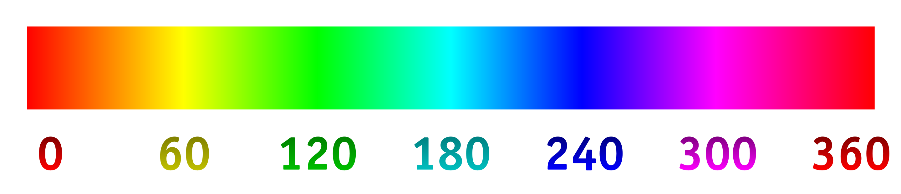

# Obsidian Enhanced Treemap Plugin

This is a data visualization plugin for [Obsidian](https://obsidian.md), based on [D3.js](https://d3js.org), that allows for the creation of [Nested Treemaps](https://observablehq.com/@d3/nested-treemap).
Treemaps are a useful way to visualize hierarchical data in a very compact form.
Normally treemaps only show text for the leaves of the tree, however nested treemaps also show text for the branches.

- [Examples](#examples)
    - [Simple Example](#simple-example)
    - [Complex Example](#complex-example)
- [Settings](#settings)
    - [Size & Shape](#size--shape)
    - [Padding](#padding)
    - [Shading & Shadows](#shading--shadows)
    - [Color](#color)
    - [Alignment](#alignment)


## Examples

### Simple Example

After installing and enabling the plugin, treemaps can be added to notes by creating JSON code blocks.
The bare minimum requirements are:
- The code block must have the type `json`
- The code block must contain valid JSON
- The root node must have this element: `"type": "enhancedtreemap"`
- The root node must have at least one `"children"` array
- The `"children"` array must have at least one child node

<pre>
```json
{
    "type": "enhancedtreemap",
    "name": "Header",
    "settings": [
        { "aspect_ratio": "3:1" }
    ],
    "children": [
        { "name": "Cell 1", "value": 2 },
        { "name": "Cell 2" }
    ]
}
```
</pre>


### Complex Example

The images below show how an enhanced treemap can be used to add context and style that is not available in a standard treemap. Here is the [JSON code block](examples/ComplexExample.md) used to create the enhanced treemap.

#### Normal Treemap


#### Enhanced Treemap


## Settings

The treemap below describes all of the available settings for the Enhanced Treemap plugin. Here is the [JSON code block](examples/Settings.md) used to create it.


### Size & Shape Settings
#### aspect_ratio
    
    Use this setting to change the ratio of the width to the height for the treemap.
    Valid values: a string containing two positive numbers separated by a colon.

| Example                 | Result                                                          |
| -------                 | ------                                                          |
| `"aspect_ratio": "1:1"` | the treemap will be square                                      |
| `"aspect_ratio": "2:1"` | the treemap will have a width twice as large as its height      |
| `"aspect_ratio": "1:4"` | the treemap will have a height four times as large as its width |

#### fixed_width
    
    Use this setting to determine if the treemap has a fixed or adaptive width.
    Valid values: true, false
    
| Example                | Result                                    |
| -------                | ------                                    |
| `"fixed_width": true`  | the treemap will have a fixed width       |
| `"fixed_width": false` | the treemap will fill the available width |

#### width
    
    Use this setting to change the width of the treemap if fixed_sidth is true.
    Valid values: a positive number
    
| Example        | Result                                                       |
| -------        | ------                                                       |
| `"width": 500` | the treemap will be 500 pixels wide if `fixed_width` is true |

#### show_headers

    Use this setting to show or hide headers/branches and their text in the treemap.
    Valid values: true, false
 
| Example                 | Result                                                                       |
| -------                 | ------                                                                       |
| `"show_headers": true`  | the treemap will include space for headers and will show header text         |
| `"show_headers": false` | the treemap will not include space for headers and will not show header text |

#### show_values

    Use this setting to show or hide values in the cells/leaves of the treemap.
    The value is added before the text in each cell.
    Valid values: true, false
    
| Example                | Result                                                                 |
| -------                | ------                                                                 |
| `"show_values": true`  | the treemap will include values in the cells/leaves of the treemap     |
| `"show_values": false` | the treemap will not include values in the cells/leaves of the treemap |

#### sort_by_value

    Use this setting to change how the treemap cells are sorted.
    Valid values: true, false
    
| Example                  | Result                                                                   |
| -------                  | ------                                                                   |
| `"sort_by_value": true`  | the treemap cells will be sorted by value (largest values first)         |
| `"sort_by_value": false` | the treemap cells will remain in the order they appear in the code block |

#### text_size & h_text_size

    Use this setting to change the text size.
    In the `settings` section of a treemap
        - use `h_text_size` to set the text size for headers
        - use `text_size` to set the text size for cells
    When updating this setting for individual headers or cells use `text_size` even for headers.
    Valid values: a positive number

| Example             | Result                                                                            |
| -------             | ------                                                                            |
| `"h_text_size": 16` | Set the text size for all headers to 16px (only applicable in `settings` section) |
| `"text_size": 14`   | Set the text size for all cells to 14px (if used in `settings` section)           |
| `"text_size": 14`   | Set the text size for a header to 14px (if used within a header node)             |
| `"text_size": 14`   | Set the text size for a cell to 14px (if used within a cell node)                 |


### Padding Settings
#### outer_padding

    Use this setting to change the amount of padding around headers and cells.
    Valid values: a positive number or zero

| Example              | Result                                                           |
| -------              | ------                                                           |
| `"outer_padding": 8` | Set the padding around all cells and headers to 8px              |
| `"outer_padding": 0` | Set the padding around all cells and headers to 0px (no padding) |

#### text_padding & h_text_padding

    Use this setting to change the padding around text within headers and cells.
    In the `settings` section of a treemap
        - use `h_text_padding` to set the text padding for headers
        - use `text_padding` to set the text padding for cells
    When updating this setting for individual headers or cells use `text_padding` even for headers.
    Valid values: a positive number or zero

| Example               | Result                                                                              |
| -------               | ------                                                                              |
| `"h_text_padding": 6` | Set the text padding for all headers to 6px (only applicable in `settings` section) |
| `"text_padding": 4`   | Set the text padding for all cells to 4px (if used in `settings` section)           |
| `"text_padding": 4`   | Set the text padding for a header to 4px (if used within a header node)             |
| `"text_padding": 4`   | Set the text padding for a cell to 4px (if used within a cell node)                 |


### Shading & Shadows Settings
#### shading & h_shading

    Use this setting to turn on/off header and cell shading.
    In the `settings` section of a treemap
        - use `h_shading` to set the shading for headers
        - use `shading` to set the shading for cells
    When updating this setting for individual headers or cells use `shading` even for headers.
    Valid values: true or false

| Example             | Result                                                                 |
| -------             | ------                                                                 |
| `"h_shading": true` | Enable shading for all headers (only applicable in `settings` section) |
| `"shading": true`   | Enable shading for all cells (if used in `settings` section)           |
| `"shading": false`  | Disable shading for a header (if used within a header node)            |
| `"shading": false`  | Disable shading for a cell (if used within a cell node)                |

#### shadow & h_shadow

    Use this setting to turn on/off header and cell drop shadows.
    In the `settings` section of a treemap
        - use `h_shadow` to set drop shadows for headers
        - use `shadow` to set drop shadows for cells
    When updating this setting for individual headers or cells use `shadow` even for headers.
    Valid values: true or false

| Example            | Result                                                                      |
| -------            | ------                                                                      |
| `"h_shadow": true` | Enable drop shadows for all headers (only applicable in `settings` section) |
| `"shadow": true`   | Enable drop shadows for all cells (if used in `settings` section)           |
| `"shadow": false`  | Disable drop shadows for a header (if used within a header node)            |
| `"shadow": false`  | Disable drop shadows for a cell (if used within a cell node)                |

#### shadow_size & h_shadow_size

    Use this setting to change the drop shadow size for headers and cells.
    In the `settings` section of a treemap
        - use `h_shadow_size` to set the drop shadow size for headers
        - use `shadow_size` to set the drop shadow size for cells
    When updating this setting for individual headers or cells use `shadow_size` even for headers.
    Valid values: a positive number or zero

| Example              | Result                                                                                  |
| -------              | ------                                                                                  |
| `"h_shadow_size": 3` | Set the drop shadow size for all headers to 3px (only applicable in `settings` section) |
| `"shadow_size": 3`   | Set the drop shadow size for all cells to 3px (if used in `settings` section)           |
| `"shadow_size": 3`   | Set the drop shadow size for a header to 3px (if used within a header node)             |
| `"shadow_size": 3`   | Set the drop shadow size for a cell to 3px (if used within a cell node)                 |


### Color Settings
#### border_color & h_border_color

    Use this setting to change the border color for headers and cells.
    In the `settings` section of a treemap
        - use `h_border_color` to set the border color for headers
        - use `border_color` to set the border color for cells
    When updating this setting for individual headers or cells use `border_color` even for headers.
    Valid values: a set containing any of the following elements:
        - h: a number from 0 to 360 to specify the hue (see image below)
        - s: a number from 0 to 1 to specify the saturation
        - l: a number from 0 to 1 to specify the lightness
        - a: a number from 0 to 1 to specify the alpha/transparency



| Example                                                 | Result                                                                                                                   |
| -------                                                 | ------                                                                                                                   |
| `"h_border_color": { "h":20, "s":0.5, "l":0.2, "a":1 }` | Sets hue = 20, sat = 50%, lightness = 20% and alpha = 100% for all header borders (only applicable in`settings` section) |
| `"border_color": { "h":20, "s":0.5, "l":0.2, "a":1 }`   | Sets hue = 20, sat = 50%, lightness = 20% and alpha = 100% for all cell borders (if used in `settings` section)          |
| `"border_color": { "l":1 }`                             | Sets lightness = 100% for applicable border (hue, saturation and alpha are unchanged)                                    |
| `"border_color": { "s":0, "a":0.5 }`                    | Sets saturation = 0 and alpha = 50% for applicable border (hue and lightness are unchanged)                              |

#### fill & h_fill

    Use this setting to change the fill color for headers and cells.
    In the `settings` section of a treemap
        - use `h_fill` to set the fill color for headers
        - use `fill` to set the fill color for cells
    When updating this setting for individual headers or cells use `fill` even for headers.
    Valid values: a set containing any of the following elements:
        - h: a number from 0 to 360 to specify the hue (see image below)
        - s: a number from 0 to 1 to specify the saturation
        - l: a number from 0 to 1 to specify the lightness
        - a: a number from 0 to 1 to specify the alpha/transparency


| Example                                         | Result                                                                                                                       |
| -------                                         | ------                                                                                                                       |
| `"h_fill": { "h":20, "s":0.5, "l":0.2, "a":1 }` | Sets hue = 20, sat = 50%, lightness = 20% and alpha = 100% for filling all headers (only applicable in`settings` section)    |
| `"fill": { "h":20, "s":0.5, "l":0.2, "a":1 }`   | Sets hue = 20, sat = 50%, lightness = 20% and alpha = 100% for filling all cells (if used in `settings` section)             |
| `"fill": { "l":1 }`                             | Sets lightness = 100% for filling applicable header or cell (hue, saturation and alpha are unchanged)                        |
| `"fill": { "s":0, "a":0.5 }`                    | Sets saturation = 0 and alpha = 50% for filling applicable header or cell (hue and lightness are unchanged)                  |
|                                                 |                                                                                                                              |

#### text_color & h_text_color

    Use this setting to change the text color for headers and cells.
    In the `settings` section of a treemap
        - use `h_text_color` to set the text color for headers
        - use `text_color` to set the text color for cells
    When updating this setting for individual headers or cells use `text_color` even for headers.
    Valid values: a set containing any of the following elements:
        - h: a number from 0 to 360 to specify the hue (see image below)
        - s: a number from 0 to 1 to specify the saturation
        - l: a number from 0 to 1 to specify the lightness
        - a: a number from 0 to 1 to specify the alpha/transparency


| Example                                               | Result                                                                                                                |
| -------                                               | ------                                                                                                                |
| `"h_text_color": { "h":20, "s":0.5, "l":0.2, "a":1 }` | Sets hue = 20, sat = 50%, lightness = 20% and alpha = 100% for all header text (only applicable in`settings` section) |
| `"text_color": { "h":20, "s":0.5, "l":0.2, "a":1 }`   | Sets hue = 20, sat = 50%, lightness = 20% and alpha = 100% for all cell text (if used in `settings` section)          |
| `"text_color": { "l":1 }`                             | Sets lightness = 100% for applicable text (hue, saturation and alpha are unchanged)                                   |
| `"text_color": { "s":0, "a":0.5 }`                    | Sets saturation = 0 and alpha = 50% for applicable text (hue and lightness are unchanged)                             |


### Alignment Settings
#### halign & h_halign

> Use this setting to change the horizontal alignment of text within headers and cells.
> In the `settings` section of a treemap
> - use `h_halign` to set the text padding for headers
> - use `halign` to set the text padding for cells
>
> When updating this setting for individual headers or cells use `halign` even for headers.
> - Valid values: "left", "center" or "right"

| Example                | Result                                                                     |
| -------                | ------                                                                     |
| `"h_halign": "center"` | Center aligns text for all headers (only applicable in `settings` section) |
| `"halign": "center"`   | Center aligns text for all cells (if used in `settings` section)           |
| `"halign": "right"`    | Right aligns text for a header (if used within a header node)              |
| `"halign": "right"`    | Right aligns text for a cell (if used within a cell node)                  |

#### valign

> Use this setting to change the vertical alignment of text within cells.
> There is no vertical alignment setting for headers.
> - Valid values: "top", "center" or "bottom"

| Example              | Result                                                               |
| -------              | ------                                                               |
| `"valign": "center"` | Centers text vertically in all cells (if used in `settings` section) |
| `"valign": "bottom"` | Moves text to the bottom of a cell (if used within a cell node)      |


## Releasing new releases

- Update your `manifest.json` with your new version number, such as `1.0.1`, and the minimum Obsidian version required for your latest release.
- Update your `versions.json` file with `"new-plugin-version": "minimum-obsidian-version"` so older versions of Obsidian can download an older version of your plugin that's compatible.
- Create new GitHub release using your new version number as the "Tag version". Use the exact version number, don't include a prefix `v`. See here for an example: https://github.com/obsidianmd/obsidian-sample-plugin/releases
- Upload the files `manifest.json`, `main.js`, `styles.css` as binary attachments. Note: The manifest.json file must be in two places, first the root path of your repository and also in the release.
- Publish the release.

> You can simplify the version bump process by running `npm version patch`, `npm version minor` or `npm version major` after updating `minAppVersion` manually in `manifest.json`.
> The command will bump version in `manifest.json` and `package.json`, and add the entry for the new version to `versions.json`

## Adding your plugin to the community plugin list

- Check https://github.com/obsidianmd/obsidian-releases/blob/master/plugin-review.md
- Publish an initial version.
- Make sure you have a `README.md` file in the root of your repo.
- Make a pull request at https://github.com/obsidianmd/obsidian-releases to add your plugin.

