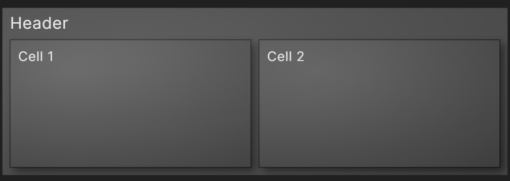

# Obsidian Enhanced Treemap Plugin

This is a data visualization plugin for [Obsidian](https://obsidian.md), based on [D3.js](https://d3js.org), that allows for the creation of [Nested Treemaps](https://observablehq.com/@d3/nested-treemap).

- [Simple Example](#simple-example)
- [Settings](#settings)
- [Options](#options)
    - [Size & Shape Settings](#size--shape-settings)
    - [Alignment Settings](#alignment-settings)
    - [Color Settings](#color-settings)
    - [Other Styling Settings](#other-styling-settings)

## Simple Example

After installing and enabling the plugin, treemaps can be added to notes by creating json code blocks.
- Only json code blocks are checked.
- The first two rows inside the code block must be exactly as shown below.
- Each cell must have a **"name"** element. The value for this element will be shown as the text for the cell.
- The children for a cell must be contained in a **"children"** array.

<pre>
```json
{
"type": "enhancedtreemap",
"name": "Header",
"children": [
    { "name": "Cell 1" },
    { "name": "Cell 2" }
]
}
```
</pre>



## Settings

Here is the [JSON code block](example/Settings.md) used to create the treemap below.


## Releasing new releases

- Update your `manifest.json` with your new version number, such as `1.0.1`, and the minimum Obsidian version required for your latest release.
- Update your `versions.json` file with `"new-plugin-version": "minimum-obsidian-version"` so older versions of Obsidian can download an older version of your plugin that's compatible.
- Create new GitHub release using your new version number as the "Tag version". Use the exact version number, don't include a prefix `v`. See here for an example: https://github.com/obsidianmd/obsidian-sample-plugin/releases
- Upload the files `manifest.json`, `main.js`, `styles.css` as binary attachments. Note: The manifest.json file must be in two places, first the root path of your repository and also in the release.
- Publish the release.

> You can simplify the version bump process by running `npm version patch`, `npm version minor` or `npm version major` after updating `minAppVersion` manually in `manifest.json`.
> The command will bump version in `manifest.json` and `package.json`, and add the entry for the new version to `versions.json`

## Adding your plugin to the community plugin list

- Check https://github.com/obsidianmd/obsidian-releases/blob/master/plugin-review.md
- Publish an initial version.
- Make sure you have a `README.md` file in the root of your repo.
- Make a pull request at https://github.com/obsidianmd/obsidian-releases to add your plugin.

