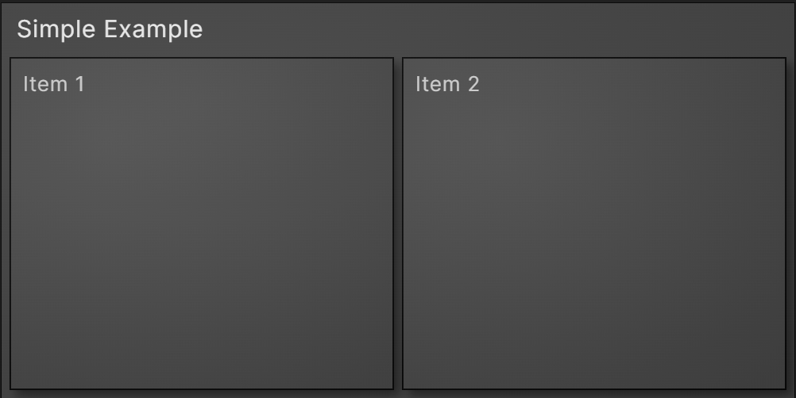

# Obsidian Enhanced TreeMap Plugin

This is a data visualization plugin for [Obsidian](https://obsidian.md), based on [D3.js](https://d3js.org), that allows for the creation of [Nested Treemaps](https://observablehq.com/@d3/nested-treemap).

- [Simple Example](#simple-example)
- [Complex Example](#complex-example)
- [Options](#options)
    - [Size & Shape Settings](#size--shape-settings)
    - [Alignment Settings](#alignment-settings)
    - [Color Settings](#color-settings)
    - [Other Styling Settings](#other-styling-settings)

## Simple Example

After installing and enabling the plugin, treemaps can be added to notes by creating json code blocks.
- Only json code blocks are checked.
- The first two rows inside the code block must be exactly as shown below.
- Each cell must have a **"name"** element. The value for this element will be shown as the text for the cell.
- The children for a cell must be contained in a **"children"** array.

<pre>
```json
{
"type": "enhancedtreemap",
"name": "Simple Example",
"children": [
    { "name": "Item 1" },
    { "name": "Item 2" }
]
}
```
</pre>



## Complex Example


## Options

- Treemaps can be customized in the plugins settings
- Plugin settings can be overridden for individual treemaps in the options section of a treemap
- Some treemap options can be overridden for individual cells in the attributes of a cell

### Size & Shape Settings

| Plugin Setting      | Treemap Option | Cell Attribute | Default |
| Aspect Ratio        | aspect_ratio   |                | "1:1"   |
| Fixed Width         | fixed_width    |                | false   |
| Treemap Width       | width          |                | 500     |
| Header Text Size    | header_size    | text_size      | 16      |
| Cell Text Size      | text_size      | text_size      | 13      |
| Header Padding Size | header_padding |                | 8       |
| Text Padding Size   | text_padding   |                | 8       |
| Cell Padding Size   | cell_padding   |                | 8       |
| Sort Cells by Size  | sort           |                | true    |

## Alignment Settings

| Plugin Setting       | Treemap Option       | Cell Attribute       | Default |
| Header Alignment     | header_alignment     | header_alignment     | "left"  |
| Horizontal Alignment | horizontal_alignment | horizontal_alignment | "left"  |
| Vertical Alignment   | vertical_alignment   | vertical_alignment   | "top"   |

## Color Settings

| Plugin Setting    | Treemap Option | Cell Attribute | Default             |
| Border Color      | border_color   | border_color   | rsla(0, 0, 0, 0.5)  |
| Header Text Color | header_color   | header_color   | rsla(0, 0, 0.9, 1)  |
| Text Color        | text_color     | text_color     | rsla(0, 0, 0.8, 1)  |
| Cell Color        | fill           | fill           | rsla(0, 0, 0.25, 1) |

## Other Styling Settings

| Plugin Setting | Treemap Option | Cell Attribute | Default |
| Show Headers   | show_headers   |                | true    |
| Show Values    | show_values    |                | false   |
| Shading        | shading        |                | true    |
| Drop Shadows   | shadows        |                | true    |
| Shadow Size    | shadow_size    |                | 4       |

## Releasing new releases

- Update your `manifest.json` with your new version number, such as `1.0.1`, and the minimum Obsidian version required for your latest release.
- Update your `versions.json` file with `"new-plugin-version": "minimum-obsidian-version"` so older versions of Obsidian can download an older version of your plugin that's compatible.
- Create new GitHub release using your new version number as the "Tag version". Use the exact version number, don't include a prefix `v`. See here for an example: https://github.com/obsidianmd/obsidian-sample-plugin/releases
- Upload the files `manifest.json`, `main.js`, `styles.css` as binary attachments. Note: The manifest.json file must be in two places, first the root path of your repository and also in the release.
- Publish the release.

> You can simplify the version bump process by running `npm version patch`, `npm version minor` or `npm version major` after updating `minAppVersion` manually in `manifest.json`.
> The command will bump version in `manifest.json` and `package.json`, and add the entry for the new version to `versions.json`

## Adding your plugin to the community plugin list

- Check https://github.com/obsidianmd/obsidian-releases/blob/master/plugin-review.md
- Publish an initial version.
- Make sure you have a `README.md` file in the root of your repo.
- Make a pull request at https://github.com/obsidianmd/obsidian-releases to add your plugin.

