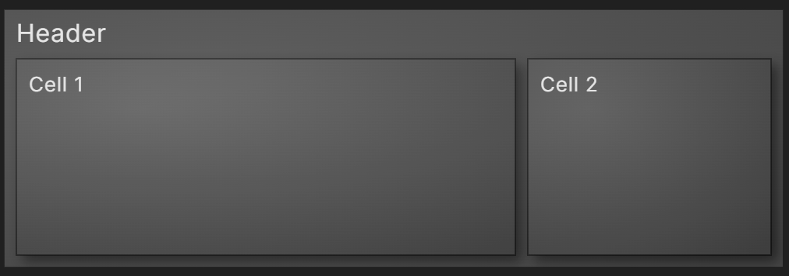
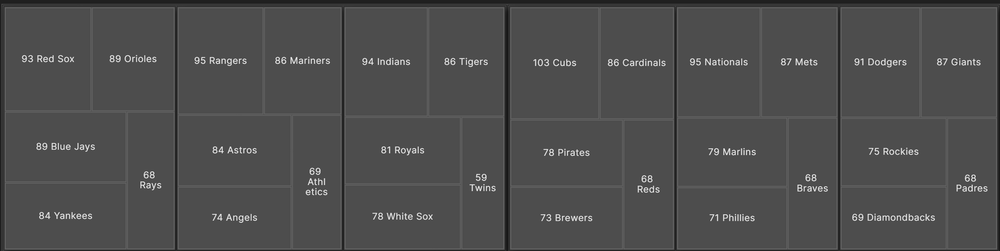
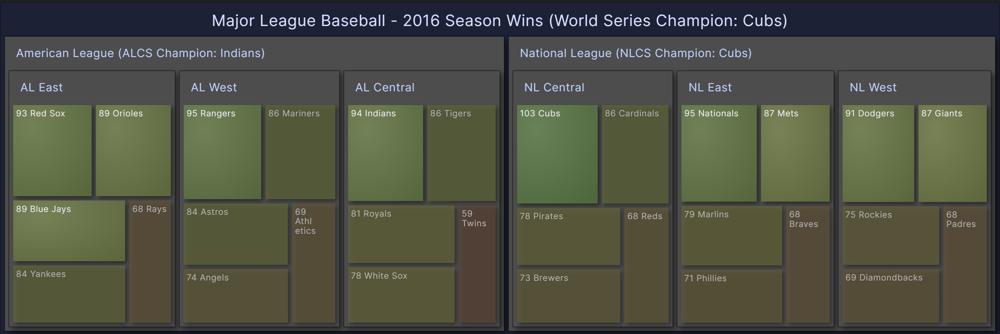
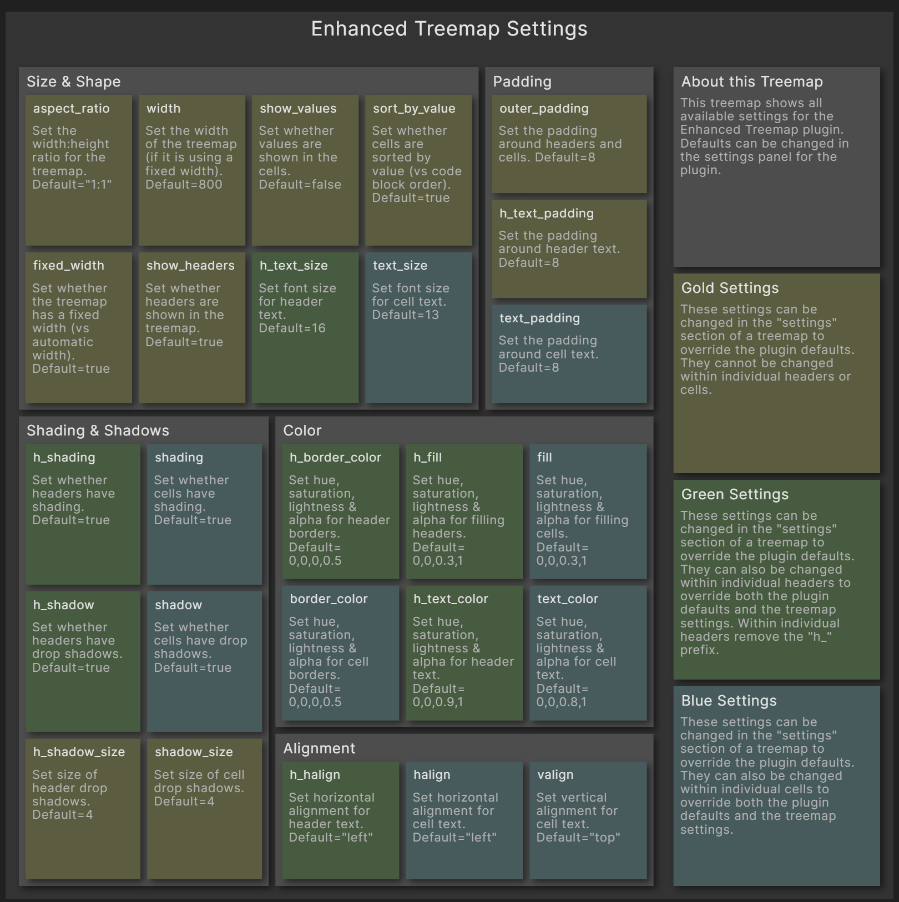

# Obsidian Enhanced Treemap Plugin

This is a data visualization plugin for [Obsidian](https://obsidian.md), based on [D3.js](https://d3js.org), that allows for the creation of [Nested Treemaps](https://observablehq.com/@d3/nested-treemap).
Treemaps are a useful way to visualize hierarchical data in a very compact form.
Normally treemaps only show text for the leaves of the tree, however nested treemaps also show text for the branches.

- [Simple Example](#simple-example)
- [Complex Example](#complex-example)
- [Settings](#settings)
    - Size & Shape
    - Padding
    - Shading & Shadows
    - Color
    - Alignment

## Simple Example

After installing and enabling the plugin, treemaps can be added to notes by creating JSON code blocks.
The bare minimum requirements are:
- The code block must have the type `json`
- The code block must contain valid JSON
- The root node must have this element: `"type": "enhancedtreemap"`
- The root node must have at least one `"children"` array
- The `"children"` array must have at least one child node

<pre>
```json
{
    "type": "enhancedtreemap",
    "name": "Header",
    "settings": [
        { "aspect_ratio": "3:1" }
    ],
    "children": [
        { "name": "Cell 1", "value": 2 },
        { "name": "Cell 2" }
    ]
}
```
</pre>



## Complex Example

The examples below compare a simple treemap with an enhanced treemap to demonstrate some of the available features. Here is the [JSON code block](examples/ComplexExample.md) used to create the enhanced treemap.




## Settings

The treemap below describes all of the available settings for the Enhanced Treemap plugin. Here is the [JSON code block](examples/Settings.md) used to create it.



### Size & Shape
### Padding
### Shading & Shadows
### Color
### Alignment

## Releasing new releases

- Update your `manifest.json` with your new version number, such as `1.0.1`, and the minimum Obsidian version required for your latest release.
- Update your `versions.json` file with `"new-plugin-version": "minimum-obsidian-version"` so older versions of Obsidian can download an older version of your plugin that's compatible.
- Create new GitHub release using your new version number as the "Tag version". Use the exact version number, don't include a prefix `v`. See here for an example: https://github.com/obsidianmd/obsidian-sample-plugin/releases
- Upload the files `manifest.json`, `main.js`, `styles.css` as binary attachments. Note: The manifest.json file must be in two places, first the root path of your repository and also in the release.
- Publish the release.

> You can simplify the version bump process by running `npm version patch`, `npm version minor` or `npm version major` after updating `minAppVersion` manually in `manifest.json`.
> The command will bump version in `manifest.json` and `package.json`, and add the entry for the new version to `versions.json`

## Adding your plugin to the community plugin list

- Check https://github.com/obsidianmd/obsidian-releases/blob/master/plugin-review.md
- Publish an initial version.
- Make sure you have a `README.md` file in the root of your repo.
- Make a pull request at https://github.com/obsidianmd/obsidian-releases to add your plugin.

